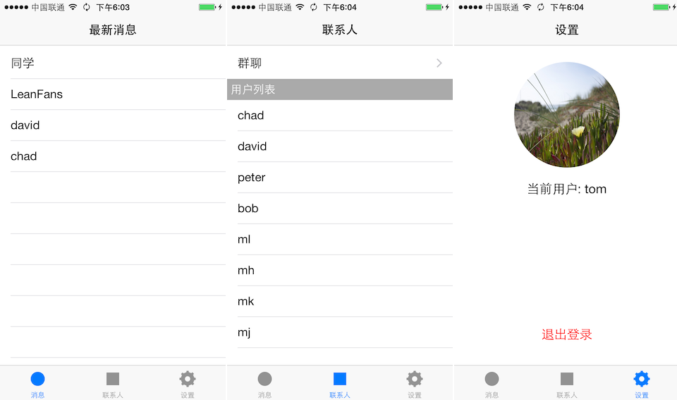
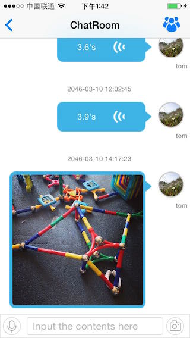
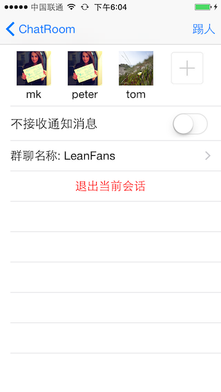

# FreeChat

FreeChat 是基于 [LeanCloud](https://leancloud.cn) 实时[消息服务](https://leancloud.cn/features/message.html)的一个聊天 app。

## 功能

FreeChat 的主要功能与微信类似。主要的模块分为三块：最新消息、联系人和设置，主界面如下图所示：

用户选择了一个联系人之后，就可以开始对话，对话界面如下图所示：

在这里用户可以发送文本、图片或者语音消息。而点击右上角的图标，则可以看到对话的详情，界面如下图所示：

在这里用户可以邀请其他人加入群聊，也可以踢出恶意发言的人，还可以修改群聊名称和设置是否接收离线通知，以及推出当前对话。

除此之外，FreeChat 也是需要用户注册、登录的。这部分功能的实现，则是基于 LeanCloud 的[数据存储](https://leancloud.cn/features/storage.html)服务完成的。

## 实现

### 消息响应

coming soon...

### 消息本地缓存

coming soon...

### 消息离线通知

coming soon...

### 用户账户管理

coming soon...

## 第三方库

所有功能都是基于 LeanCloud 平台完成的，所以第一感谢 LeanCloud。在本项目的开发过程中，还用到了如下第三方代码，在此一并表示感谢：

* [MJRefresh](https://github.com/CoderMJLee/MJRefresh) 不多说，用来下拉加载更多历史消息。
* [fmdb](https://github.com/ccgus/fmdb) sqlite 的 objective-c 封装，本项目中用来本地缓存历史消息。
* [UUChatTableView](https://github.com/ZhipingYang/UUChatTableView) 非常棒的一个聊天组件库，本项目中部分用来实现聊天界面。
* [AFNetworking](https://github.com/AFNetworking/AFNetworking) 不多说。
* voiceLib 半天没有找到来路，本项目中用来语音录入及格式转化成MP3。